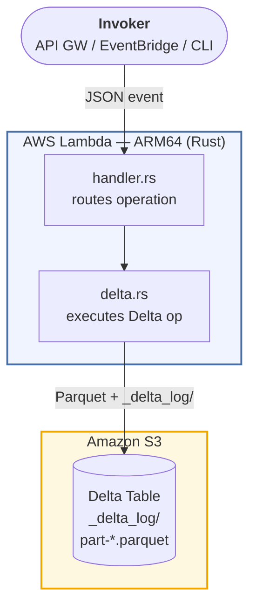

# deltalake-lambda-rust-ingestion

AWS Lambda written in Rust that ingests JSON records into **Delta Lake** tables stored on S3 as **Parquet** files. Built with [delta-rs](https://github.com/delta-io/delta-rs), the native Rust implementation of the Delta Lake protocol.

---

## Architecture



Each Lambda invocation is stateless. The Delta transaction log (`_delta_log/`) on S3 provides ACID guarantees, versioning, and full audit history.

---

## Delta Lake Features Demonstrated

| Feature | Operation | Description |
|---|---|---|
| ACID writes | `insert` | Append-only write with atomic commit |
| Schema enforcement | `create_table` / `insert` | Rejects records that don't match the declared schema |
| Partitioning | `create_table` / `insert` | Organizes Parquet files by partition columns |
| Merge / Upsert | `upsert` | Update-or-insert using a SQL predicate |
| Time Travel | `time_travel` | Read any historical version by number or timestamp |
| Audit log | `table_history` | Full commit history with operation metadata |
| Compaction | `optimize` | Compact small Parquet files into larger ones |
| Z-order clustering | `optimize` | Co-locate related data for faster predicate pushdown |
| Vacuum | `vacuum` | Remove orphaned Parquet files after retention period |

---

## Prerequisites

- **Rust** 1.84+
- **cargo-lambda** — `cargo install cargo-lambda`
- **AWS CLI** configured with permissions to create Lambda functions
- An **S3 bucket** for the Delta tables
- An **IAM role** for the Lambda execution (see [IAM Policy](#iam-policy))

---

## Quick Start

```bash
# 1. Build release binary (ARM64, optimized for Lambda cold starts)
make release

# 2. Deploy to AWS Lambda
make deploy \
  FUNCTION_NAME=deltalake-ingestion \
  S3_BUCKET=my-delta-lake-bucket \
  ROLE_ARN=arn:aws:iam::123456789012:role/deltalake-ingestion-role \
  REGION=us-east-1

# 3. Create a Delta table
make invoke-create S3_BUCKET=my-delta-lake-bucket

# 4. Insert records
make invoke-insert S3_BUCKET=my-delta-lake-bucket

# 5. Query schema and history
make invoke-schema S3_BUCKET=my-delta-lake-bucket
make invoke-history S3_BUCKET=my-delta-lake-bucket
```

---

## Event Schema

All requests share the same envelope:

```json
{
  "operation": "<operation_name>",
  "table_uri": "s3://my-bucket/path/to/table",
  "payload": { }
}
```

All responses:

```json
{
  "success": true,
  "operation": "insert",
  "table_uri": "s3://my-bucket/path/to/table",
  "result": { },
  "error": null
}
```

On failure, `success` is `false`, `result` is omitted, and `error` contains the message. Lambda itself does not fail (no retry) for application-level errors.

---

## Operations

### `create_table`

Create a new Delta table with an explicit schema. Idempotent — safe to call if the table already exists.

```json
{
  "operation": "create_table",
  "table_uri": "s3://my-bucket/tables/events",
  "payload": {
    "schema": [
      { "name": "id",         "data_type": "long",      "nullable": false },
      { "name": "event_type", "data_type": "string",    "nullable": true  },
      { "name": "value",      "data_type": "double",    "nullable": true  },
      { "name": "created_at", "data_type": "timestamp", "nullable": true  }
    ],
    "partition_columns": ["event_type"]
  }
}
```

**Response:**
```json
{ "version": 0, "message": "Table created (or already existed)" }
```

---

### `insert`

Append records to an existing Delta table. Records are validated against the table schema.

```json
{
  "operation": "insert",
  "table_uri": "s3://my-bucket/tables/events",
  "payload": {
    "records": [
      { "id": 1, "event_type": "click",    "value": 1.5,  "created_at": 1704067200000000 },
      { "id": 2, "event_type": "view",     "value": 2.0,  "created_at": 1704067260000000 },
      { "id": 3, "event_type": "purchase", "value": 49.99, "created_at": 1704067320000000 }
    ],
    "partition_columns": ["event_type"]
  }
}
```

> **Note:** `timestamp` columns accept microseconds since epoch (Unix time × 1,000,000).

**Response:**
```json
{ "version": 1, "rows_written": 3 }
```

---

### `upsert`

Merge records into the table: update rows that match the predicate, insert rows that don't.

```json
{
  "operation": "upsert",
  "table_uri": "s3://my-bucket/tables/events",
  "payload": {
    "records": [
      { "id": 1, "event_type": "click", "value": 9.99, "created_at": 1704067200000000 },
      { "id": 4, "event_type": "purchase", "value": 99.0, "created_at": 1704153600000000 }
    ],
    "merge_predicate": "target.id = source.id",
    "match_columns": ["id"]
  }
}
```

**Response:**
```json
{
  "version": 2,
  "num_source_rows": 2,
  "num_target_rows_inserted": 1,
  "num_target_rows_updated": 1,
  "num_target_rows_deleted": 0,
  "num_output_rows": 4
}
```

---

### `get_schema`

Return the current schema and version of the table.

```json
{
  "operation": "get_schema",
  "table_uri": "s3://my-bucket/tables/events",
  "payload": {}
}
```

**Response:**
```json
{
  "version": 2,
  "num_files": 3,
  "schema": {
    "fields": [
      { "name": "id",         "data_type": "long",      "nullable": false },
      { "name": "event_type", "data_type": "string",    "nullable": true  },
      { "name": "value",      "data_type": "double",    "nullable": true  },
      { "name": "created_at", "data_type": "timestamp", "nullable": true  }
    ]
  }
}
```

---

### `table_history`

Return the commit log (audit trail) of the table.

```json
{
  "operation": "table_history",
  "table_uri": "s3://my-bucket/tables/events",
  "payload": { "limit": 10 }
}
```

**Response:**
```json
{
  "total_commits": 3,
  "history": [
    {
      "version": 2,
      "timestamp": 1704153700000,
      "operation": "MERGE",
      "operation_parameters": { "predicate": "target.id = source.id" }
    },
    {
      "version": 1,
      "timestamp": 1704067400000,
      "operation": "WRITE",
      "operation_parameters": { "mode": "Append", "partitionBy": "[\"event_type\"]" }
    },
    {
      "version": 0,
      "timestamp": 1704067200000,
      "operation": "CREATE TABLE",
      "operation_parameters": {}
    }
  ]
}
```

---

### `time_travel`

Read the table metadata as it existed at a specific version or timestamp.

**By version:**
```json
{
  "operation": "time_travel",
  "table_uri": "s3://my-bucket/tables/events",
  "payload": { "version": 0 }
}
```

**By timestamp (RFC3339):**
```json
{
  "operation": "time_travel",
  "table_uri": "s3://my-bucket/tables/events",
  "payload": { "timestamp": "2024-01-01T00:00:00Z" }
}
```

**Response:**
```json
{
  "version": 0,
  "num_files": 0,
  "schema": { "fields": [ ... ] }
}
```

---

### `vacuum`

Remove Parquet files that are no longer referenced by the Delta log and older than the retention period. Use `dry_run: true` to preview without deleting.

```json
{
  "operation": "vacuum",
  "table_uri": "s3://my-bucket/tables/events",
  "payload": {
    "retention_hours": 168,
    "dry_run": true
  }
}
```

**Response:**
```json
{
  "version": 2,
  "dry_run": true,
  "files_deleted": [
    "part-00000-abc123.snappy.parquet"
  ]
}
```

---

### `optimize`

Compact small Parquet files and optionally apply Z-order clustering to co-locate related data.

**Plain compaction:**
```json
{
  "operation": "optimize",
  "table_uri": "s3://my-bucket/tables/events",
  "payload": {}
}
```

**Z-order on `event_type`:**
```json
{
  "operation": "optimize",
  "table_uri": "s3://my-bucket/tables/events",
  "payload": {
    "zorder_columns": ["event_type"],
    "target_file_size": 268435456
  }
}
```

**Response:**
```json
{
  "version": 3,
  "files_added": 1,
  "files_removed": 3,
  "total_files_skipped": 0
}
```

---

## Supported Schema Types

| `data_type` string | Delta Lake type | Arrow type |
|---|---|---|
| `"string"` / `"str"` | `string` | `Utf8` |
| `"integer"` / `"int"` | `integer` | `Int32` |
| `"long"` | `long` | `Int64` |
| `"float"` | `float` | `Float32` |
| `"double"` | `double` | `Float64` |
| `"boolean"` / `"bool"` | `boolean` | `Boolean` |
| `"date"` | `date` | `Date32` |
| `"timestamp"` | `timestamp` | `Timestamp(µs)` |
| `"timestamp_ntz"` | `timestamp_ntz` | `Timestamp(µs)` |
| `"binary"` | `binary` | `Binary` |

---

## IAM Policy

The Lambda execution role needs the following permissions:

```json
{
  "Version": "2012-10-17",
  "Statement": [
    {
      "Effect": "Allow",
      "Action": [
        "s3:GetObject",
        "s3:PutObject",
        "s3:DeleteObject",
        "s3:ListBucket",
        "s3:GetBucketLocation"
      ],
      "Resource": [
        "arn:aws:s3:::my-delta-lake-bucket",
        "arn:aws:s3:::my-delta-lake-bucket/*"
      ]
    }
  ]
}
```

### Optional: DynamoDB Locking for Concurrent Writers

For workloads with multiple concurrent writers, enable DynamoDB-based optimistic concurrency control to prevent lost updates:

```json
{
  "Effect": "Allow",
  "Action": [
    "dynamodb:GetItem",
    "dynamodb:PutItem",
    "dynamodb:DeleteItem",
    "dynamodb:ConditionCheckItem"
  ],
  "Resource": "arn:aws:dynamodb:*:*:table/delta_log_lock"
}
```

Then set these Lambda environment variables:

```
AWS_S3_LOCKING_PROVIDER=dynamodb
DELTA_DYNAMO_TABLE_NAME=delta_log_lock
```

And remove `AWS_S3_ALLOW_UNSAFE_RENAME=true`.

---

## Environment Variables

| Variable | Default | Description |
|---|---|---|
| `RUST_LOG` | `info` | Log level: `error`, `warn`, `info`, `debug`, `trace` |
| `AWS_REGION` | (from Lambda env) | AWS region |
| `AWS_S3_ALLOW_UNSAFE_RENAME` | `true` | Required for single-writer S3 workloads |
| `AWS_S3_LOCKING_PROVIDER` | _(unset)_ | Set to `dynamodb` for concurrent writers |
| `DELTA_DYNAMO_TABLE_NAME` | _(unset)_ | DynamoDB table name for distributed locking |

---

## Project Structure

```
src/
├── main.rs       — tokio entry point; registers S3 object store handlers
├── handler.rs    — Lambda event routing
├── delta.rs      — All Delta Lake operations (insert, upsert, vacuum, ...)
├── models.rs     — Serde request/response types
└── error.rs      — AppError with thiserror
```

---

## Concurrency Model

**Single writer (default):** `AWS_S3_ALLOW_UNSAFE_RENAME=true` enables writes without a distributed lock. Safe only when exactly one Lambda invocation writes to a given table at a time. Read operations are always safe concurrently.

**Multiple concurrent writers:** Enable DynamoDB locking. delta-rs uses conditional writes on DynamoDB to implement optimistic concurrency control. Each commit attempt acquires a lock, writes the `_delta_log/` entry, and releases the lock. Conflicting commits are retried automatically.

---

## Cold Start Optimization

The release profile is tuned for minimum binary size:

```toml
[profile.release]
opt-level = "z"       # optimize for size
lto = true            # link-time optimization removes dead code
codegen-units = 1     # single codegen unit enables maximum optimization
panic = "abort"       # eliminates unwinding machinery
strip = true          # strip debug symbols
```

Resulting binary: ~15–20 MB (ARM64). Cold start: ~1–2 seconds on a 1024 MB function.

---

## Troubleshooting

**`no object store for scheme s3`**
`deltalake::aws::register_handlers(None)` was not called before the first `open_table`. It must be in `main()`, before `run(service_fn(...))`.

**Arrow type mismatch at compile time**
Multiple versions of `arrow-array` in the dependency tree. Run:
```bash
cargo tree -i arrow-array
```
All lines must show the same version. If not, pin the version explicitly in `Cargo.toml` to match what `deltalake` uses internally.

**`MERGE requires datafusion feature`**
Ensure `deltalake` is declared with `features = ["s3", "datafusion"]` in `Cargo.toml`.

**Lambda timeout on large `optimize`**
Z-order on large tables can exceed 15 minutes. Run `optimize` and `vacuum` as separate scheduled invocations with `TIMEOUT=900` and `MEMORY=3008`.

**Dirty reads / lost updates with concurrent writers**
Enable DynamoDB locking (see [Optional: DynamoDB Locking](#optional-dynamodb-locking-for-concurrent-writers)).

---

## License

MIT
