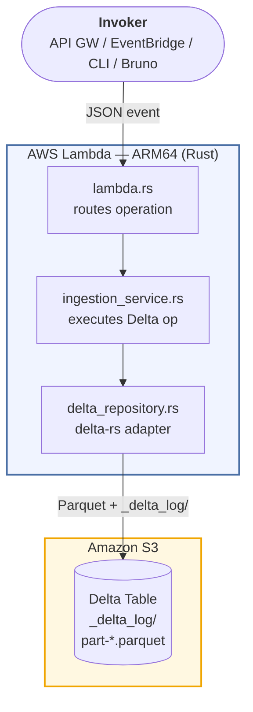

# deltalake-lambda-rust-ingestion

AWS Lambda written in Rust that ingests JSON records into **Delta Lake** tables stored on S3 as **Parquet** files. Built with [delta-rs](https://github.com/delta-io/delta-rs), the native Rust implementation of the Delta Lake protocol.

---

## Architecture



Each Lambda invocation is stateless. The Delta transaction log (`_delta_log/`) on S3 provides ACID guarantees, versioning, and full audit history.

---

## Delta Lake Features Demonstrated

| Feature            | Operation                 | Description                                          |
| ------------------ | ------------------------- | ---------------------------------------------------- |
| ACID writes        | `insert`                  | Append-only write with atomic commit                 |
| Schema enforcement | `create_table` / `insert` | Rejects records that don't match the declared schema |
| Partitioning       | `create_table` / `insert` | Organizes Parquet files by partition columns         |
| Merge / Upsert     | `upsert`                  | Update-or-insert using a SQL predicate               |
| Time Travel        | `time_travel`             | Read any historical version by number or timestamp   |
| Audit log          | `table_history`           | Full commit history with operation metadata          |
| Compaction         | `optimize`                | Compact small Parquet files into larger ones         |
| Z-order clustering | `optimize`                | Co-locate related data for faster predicate pushdown |
| Vacuum             | `vacuum`                  | Remove orphaned Parquet files after retention period |

---

## Prerequisites

### Local development

- **Rust** 1.84+
- **cargo-zigbuild** — `cargo install cargo-zigbuild --locked`
- **Zig** (used by zigbuild for cross-compilation) — `brew install zig`
- **Docker** with Compose v2 — required for MiniStack and Lambda container image
- **AWS CLI** v2

### AWS deploy

- **cargo-lambda** — `cargo install cargo-lambda`
- **AWS CLI** configured with permissions to create Lambda functions
- An **S3 bucket** for the Delta tables
- An **IAM role** for the Lambda execution (see [IAM Policy](#iam-policy))

---

## Quick Start — Local (MiniStack)

Run the entire stack locally using [MiniStack](https://ministack.dev) as the AWS emulator. No real AWS account needed.

```bash
# 1. Start MiniStack (S3 + Lambda + IAM + CloudWatch)
docker compose up -d

# 2. Build, create Docker image, and deploy Lambda (all-in-one)
make local-image-deploy

# 3. Create a Delta table
make local-invoke-create

# 4. Insert records
make local-invoke-insert

# 5. Query schema and history
make local-invoke-schema
make local-invoke-history

# 6. Browse Delta files on local S3
make local-browse-s3

# 7. Follow invocation logs
make local-logs
```

> **How it works:** `make local-image-deploy` cross-compiles to `aarch64-unknown-linux-gnu`, builds a Docker image tagged `deltalake-ingestion:latest`, then deploys it to MiniStack as a `PackageType: Image` Lambda. MiniStack's `LAMBDA_EXECUTOR=docker` reads the image directly from the host Docker daemon — no ECR push needed.

### Using Bruno

A [Bruno](https://www.usebruno.com) collection is included in the `bruno/` folder for interactive testing.

1. Open Bruno → **Open Collection** → select the `bruno/` folder
2. Select the **local** environment (`http://localhost:4566`)
3. Run the requests in order (00 → 08):

| #   | Request       | Operation                |
| --- | ------------- | ------------------------ |
| 00  | Health Check  | GET `/_ministack/health` |
| 01  | Create Table  | `create_table`           |
| 02  | Insert        | `insert`                 |
| 03  | Upsert        | `upsert`                 |
| 04  | Get Schema    | `get_schema`             |
| 05  | Table History | `table_history`          |
| 06  | Time Travel   | `time_travel`            |
| 07  | Optimize      | `optimize`               |
| 08  | Vacuum        | `vacuum`                 |

---

## Quick Start — AWS

```bash
# 1. Build release binary (ARM64, optimized for Lambda cold starts)
make release

# 2. Deploy to AWS Lambda
make deploy \
  FUNCTION_NAME=deltalake-ingestion \
  S3_BUCKET=my-delta-lake-bucket \
  ROLE_ARN=arn:aws:iam::123456789012:role/deltalake-ingestion-role \
  REGION=us-east-1

# 3. Create a Delta table
make invoke-create S3_BUCKET=my-delta-lake-bucket

# 4. Insert records
make invoke-insert S3_BUCKET=my-delta-lake-bucket

# 5. Query schema and history
make invoke-schema S3_BUCKET=my-delta-lake-bucket
make invoke-history S3_BUCKET=my-delta-lake-bucket
```

---

## Event Schema

All requests share the same envelope:

```json
{
  "operation": "<operation_name>",
  "table_uri": "s3://my-bucket/path/to/table",
  "payload": {}
}
```

All responses:

```json
{
  "success": true,
  "operation": "insert",
  "table_uri": "s3://my-bucket/path/to/table",
  "result": {},
  "error": null
}
```

On failure, `success` is `false`, `result` is omitted, and `error` contains the message. Lambda itself does not fail (no retry) for application-level errors.

---

## Operations

### `create_table`

Create a new Delta table with an explicit schema. Idempotent — safe to call if the table already exists.

```json
{
  "operation": "create_table",
  "table_uri": "s3://my-bucket/tables/events",
  "payload": {
    "schema": [
      { "name": "id", "data_type": "long", "nullable": false },
      { "name": "event_type", "data_type": "string", "nullable": true },
      { "name": "value", "data_type": "double", "nullable": true },
      { "name": "created_at", "data_type": "timestamp", "nullable": true }
    ],
    "partition_columns": ["event_type"]
  }
}
```

**Response:**

```json
{ "version": 0, "message": "Table created (or already existed)" }
```

---

### `insert`

Append records to an existing Delta table. Records are validated against the table schema.

```json
{
  "operation": "insert",
  "table_uri": "s3://my-bucket/tables/events",
  "payload": {
    "records": [
      {
        "id": 1,
        "event_type": "click",
        "value": 1.5,
        "created_at": 1704067200000000
      },
      {
        "id": 2,
        "event_type": "view",
        "value": 2.0,
        "created_at": 1704067260000000
      },
      {
        "id": 3,
        "event_type": "purchase",
        "value": 49.99,
        "created_at": 1704067320000000
      }
    ],
    "partition_columns": ["event_type"]
  }
}
```

> **Note:** `timestamp` columns accept microseconds since epoch (Unix time × 1,000,000).

**Response:**

```json
{ "version": 1, "rows_written": 3 }
```

---

### `upsert`

Merge records into the table: update rows that match the predicate, insert rows that don't.

```json
{
  "operation": "upsert",
  "table_uri": "s3://my-bucket/tables/events",
  "payload": {
    "records": [
      {
        "id": 1,
        "event_type": "click",
        "value": 9.99,
        "created_at": 1704067200000000
      },
      {
        "id": 4,
        "event_type": "purchase",
        "value": 99.0,
        "created_at": 1704153600000000
      }
    ],
    "merge_predicate": "target.id = source.id",
    "match_columns": ["id"]
  }
}
```

**Response:**

```json
{
  "version": 2,
  "num_source_rows": 2,
  "num_target_rows_inserted": 1,
  "num_target_rows_updated": 1,
  "num_target_rows_deleted": 0,
  "num_output_rows": 4
}
```

---

### `get_schema`

Return the current schema and version of the table.

```json
{
  "operation": "get_schema",
  "table_uri": "s3://my-bucket/tables/events",
  "payload": {}
}
```

**Response:**

```json
{
  "version": 2,
  "num_files": 3,
  "schema": {
    "fields": [
      { "name": "id", "data_type": "long", "nullable": false },
      { "name": "event_type", "data_type": "string", "nullable": true },
      { "name": "value", "data_type": "double", "nullable": true },
      { "name": "created_at", "data_type": "timestamp", "nullable": true }
    ]
  }
}
```

---

### `table_history`

Return the commit log (audit trail) of the table.

```json
{
  "operation": "table_history",
  "table_uri": "s3://my-bucket/tables/events",
  "payload": { "limit": 10 }
}
```

**Response:**

```json
{
  "total_commits": 3,
  "history": [
    {
      "version": 2,
      "timestamp": 1704153700000,
      "operation": "MERGE",
      "operation_parameters": { "predicate": "target.id = source.id" }
    },
    {
      "version": 1,
      "timestamp": 1704067400000,
      "operation": "WRITE",
      "operation_parameters": {
        "mode": "Append",
        "partitionBy": "[\"event_type\"]"
      }
    },
    {
      "version": 0,
      "timestamp": 1704067200000,
      "operation": "CREATE TABLE",
      "operation_parameters": {}
    }
  ]
}
```

---

### `time_travel`

Read the table metadata as it existed at a specific version or timestamp.

**By version:**

```json
{
  "operation": "time_travel",
  "table_uri": "s3://my-bucket/tables/events",
  "payload": { "version": 0 }
}
```

**By timestamp (RFC3339):**

```json
{
  "operation": "time_travel",
  "table_uri": "s3://my-bucket/tables/events",
  "payload": { "timestamp": "2024-01-01T00:00:00Z" }
}
```

**Response:**

```json
{
  "version": 0,
  "num_files": 0,
  "schema": { "fields": [ ... ] }
}
```

---

### `vacuum`

Remove Parquet files that are no longer referenced by the Delta log and older than the retention period. Use `dry_run: true` to preview without deleting.

```json
{
  "operation": "vacuum",
  "table_uri": "s3://my-bucket/tables/events",
  "payload": {
    "retention_hours": 168,
    "dry_run": true
  }
}
```

**Response:**

```json
{
  "version": 2,
  "dry_run": true,
  "files_deleted": ["part-00000-abc123.snappy.parquet"]
}
```

---

### `optimize`

Compact small Parquet files and optionally apply Z-order clustering to co-locate related data.

**Plain compaction:**

```json
{
  "operation": "optimize",
  "table_uri": "s3://my-bucket/tables/events",
  "payload": {}
}
```

**Z-order on `event_type`:**

```json
{
  "operation": "optimize",
  "table_uri": "s3://my-bucket/tables/events",
  "payload": {
    "zorder_columns": ["event_type"],
    "target_file_size": 268435456
  }
}
```

**Response:**

```json
{
  "version": 3,
  "files_added": 1,
  "files_removed": 3,
  "total_files_skipped": 0
}
```

---

## Supported Schema Types

| `data_type` string     | Delta Lake type | Arrow type      |
| ---------------------- | --------------- | --------------- |
| `"string"` / `"str"`   | `string`        | `Utf8`          |
| `"integer"` / `"int"`  | `integer`       | `Int32`         |
| `"long"`               | `long`          | `Int64`         |
| `"float"`              | `float`         | `Float32`       |
| `"double"`             | `double`        | `Float64`       |
| `"boolean"` / `"bool"` | `boolean`       | `Boolean`       |
| `"date"`               | `date`          | `Date32`        |
| `"timestamp"`          | `timestamp`     | `Timestamp(µs)` |
| `"timestamp_ntz"`      | `timestamp_ntz` | `Timestamp(µs)` |
| `"binary"`             | `binary`        | `Binary`        |

---

## IAM Policy

The Lambda execution role needs the following permissions:

```json
{
  "Version": "2012-10-17",
  "Statement": [
    {
      "Effect": "Allow",
      "Action": [
        "s3:GetObject",
        "s3:PutObject",
        "s3:DeleteObject",
        "s3:ListBucket",
        "s3:GetBucketLocation"
      ],
      "Resource": [
        "arn:aws:s3:::my-delta-lake-bucket",
        "arn:aws:s3:::my-delta-lake-bucket/*"
      ]
    }
  ]
}
```

### Optional: DynamoDB Locking for Concurrent Writers

For workloads with multiple concurrent writers, enable DynamoDB-based optimistic concurrency control to prevent lost updates:

```json
{
  "Effect": "Allow",
  "Action": [
    "dynamodb:GetItem",
    "dynamodb:PutItem",
    "dynamodb:DeleteItem",
    "dynamodb:ConditionCheckItem"
  ],
  "Resource": "arn:aws:dynamodb:*:*:table/delta_log_lock"
}
```

Then set these Lambda environment variables:

```txt
AWS_S3_LOCKING_PROVIDER=dynamodb
DELTA_DYNAMO_TABLE_NAME=delta_log_lock
```

And remove `AWS_S3_ALLOW_UNSAFE_RENAME=true`.

---

## Environment Variables

| Variable                     | Default           | Description                                          |
| ---------------------------- | ----------------- | ---------------------------------------------------- |
| `RUST_LOG`                   | `info`            | Log level: `error`, `warn`, `info`, `debug`, `trace` |
| `AWS_REGION`                 | (from Lambda env) | AWS region                                           |
| `AWS_S3_ALLOW_UNSAFE_RENAME` | `true`            | Required for single-writer S3 workloads              |
| `AWS_S3_LOCKING_PROVIDER`    | _(unset)_         | Set to `dynamodb` for concurrent writers             |
| `DELTA_DYNAMO_TABLE_NAME`    | _(unset)_         | DynamoDB table name for distributed locking          |

---

## Project Structure

```txt
src/
├── main.rs                      — tokio entry point; registers S3 object store
├── lib.rs                       — crate root
├── models.rs                    — Serde request/response types
├── error.rs                     — AppError with thiserror
├── adapters/
│   ├── inbound/
│   │   └── lambda.rs            — Lambda event handler; routes to ingestion service
│   └── outbound/
│       ├── delta_repository.rs  — delta-rs Delta Lake adapter (production)
│       └── in_memory_repository.rs — in-memory adapter (unit tests)
├── application/
│   └── ingestion_service.rs     — orchestrates operations; calls the repository port
└── domain/
    ├── commands.rs              — operation payloads (CreateTable, Insert, Upsert, …)
    ├── ports.rs                 — DeltaRepository trait (port)
    └── results.rs               — operation result types
```

The codebase follows **hexagonal architecture** (ports & adapters):

- `domain/` — pure business logic, no I/O, no AWS
- `application/` — orchestration layer, depends only on domain ports
- `adapters/inbound/` — Lambda runtime adapter (drives the application)
- `adapters/outbound/` — delta-rs / S3 adapter (driven by the application)

---

## Local Stack — docker-compose.yml

The `docker-compose.yml` starts a single MiniStack container that emulates S3, Lambda, IAM, and CloudWatch Logs:

```yaml
environment:
  - LAMBDA_EXECUTOR=docker # executes Lambda as a Docker container
  - LAMBDA_DOCKER_NETWORK=deltalake-ingestion_default
volumes:
  - /var/run/docker.sock:/var/run/docker.sock # lets MiniStack spawn Lambda containers
  - ./data/state:/tmp/ministack-state # persistent state across restarts
  - ./data/s3:/tmp/ministack-data/s3 # persistent S3 data
```

Lambda containers are spawned directly from the host Docker daemon. The network must match the Compose project network so that the Lambda container can reach MiniStack's S3 endpoint at `http://ministack:4566`.

### Makefile local targets

| Target                     | Description                                           |
| -------------------------- | ----------------------------------------------------- |
| `local-start`              | Start MiniStack and wait until healthy                |
| `local-stop`               | Stop MiniStack                                        |
| `local-setup`              | Create S3 bucket + IAM role in MiniStack              |
| `local-image-deploy`       | Build Docker image + deploy Lambda as container image |
| `local-status`             | Show MiniStack health JSON                            |
| `local-list`               | List Lambda functions and S3 buckets                  |
| `local-browse-s3`          | List Delta table files on local S3                    |
| `local-logs`               | Tail CloudWatch logs (Ctrl-C to stop)                 |
| `local-invoke-create`      | Invoke `create_table`                                 |
| `local-invoke-insert`      | Invoke `insert`                                       |
| `local-invoke-upsert`      | Invoke `upsert`                                       |
| `local-invoke-schema`      | Invoke `get_schema`                                   |
| `local-invoke-history`     | Invoke `table_history`                                |
| `local-invoke-vacuum`      | Invoke `vacuum` (dry run)                             |
| `local-invoke-optimize`    | Invoke `optimize`                                     |
| `local-invoke-time-travel` | Invoke `time_travel` at version 0                     |

---

**Single writer (default):** `AWS_S3_ALLOW_UNSAFE_RENAME=true` enables writes without a distributed lock. Safe only when exactly one Lambda invocation writes to a given table at a time. Read operations are always safe concurrently.

**Multiple concurrent writers:** Enable DynamoDB locking. delta-rs uses conditional writes on DynamoDB to implement optimistic concurrency control. Each commit attempt acquires a lock, writes the `_delta_log/` entry, and releases the lock. Conflicting commits are retried automatically.

---

## Cold Start Optimization

The release profile is tuned for minimum binary size:

```toml
[profile.release]
opt-level = "z"       # optimize for size
lto = true            # link-time optimization removes dead code
codegen-units = 1     # single codegen unit enables maximum optimization
panic = "abort"       # eliminates unwinding machinery
strip = true          # strip debug symbols
```

Resulting binary: ~30 MB (ARM64 with OpenSSL vendored). Cold start: ~1–2 seconds on a 1024 MB function.

### Container image (local deploy)

The `Dockerfile` packages the cross-compiled binary into the `provided.al2023` Lambda base image:

```dockerfile
FROM public.ecr.aws/lambda/provided:al2023-arm64
COPY target/lambda/bootstrap/bootstrap /var/runtime/bootstrap
RUN chmod +x /var/runtime/bootstrap
CMD ["bootstrap"]
```

`make local-image-deploy` builds this image with `--platform linux/arm64` and deploys it. Subsequent redeploys are fast because Docker layer caching skips the OS layers; only the binary layer is rebuilt.

---

## Troubleshooting

**`no object store for scheme s3`**
`deltalake::aws::register_handlers(None)` was not called before the first `open_table`. It must be in `main()`, before `run(service_fn(...))`.

**Arrow type mismatch at compile time**
Multiple versions of `arrow-array` in the dependency tree. Run:

```bash
cargo tree -i arrow-array
```

All lines must show the same version. If not, pin the version explicitly in `Cargo.toml` to match what `deltalake` uses internally.

**`MERGE requires datafusion feature`**
Ensure `deltalake` is declared with `features = ["s3", "datafusion"]` in `Cargo.toml`.

**Lambda timeout on large `optimize`**
Z-order on large tables can exceed 15 minutes. Run `optimize` and `vacuum` as separate scheduled invocations with `TIMEOUT=900` and `MEMORY=3008`.

**Dirty reads / lost updates with concurrent writers**
Enable DynamoDB locking (see [Optional: DynamoDB Locking](#optional-dynamodb-locking-for-concurrent-writers)).

**MiniStack: `Runtime.InvalidEntrypoint: fork/exec /var/runtime/bootstrap: no such file or directory`**
The `provided.al2023` runtime expects the handler at `/var/runtime/bootstrap`, not `/var/task/bootstrap`. Verify the `Dockerfile` `COPY` target:

```dockerfile
COPY target/lambda/bootstrap/bootstrap /var/runtime/bootstrap
```

**MiniStack: `ImageNotFound` when using ZIP deploy with `LAMBDA_EXECUTOR=docker`**
The docker executor cannot use ZIP-based functions. Use `make local-image-deploy` (container image deploy) instead of `make local-deploy`.

**MiniStack: ECR push fails with `404 Not Found`**
MiniStack does not expose a real ECR registry endpoint. The docker executor reads images directly from the host Docker daemon by name — no push is needed. Use `ImageUri=deltalake-ingestion:latest` (local image name, no registry prefix).

**MiniStack: Lambda container can't reach S3**
The Lambda container needs to be on the same Docker network as MiniStack. Ensure `LAMBDA_DOCKER_NETWORK=deltalake-ingestion_default` matches your Compose project name. Check with `docker network ls`.

**OpenSSL cross-compilation error**
Ensure `openssl = { version = "0.10", features = ["vendored"] }` is in `Cargo.toml`. `cargo-zigbuild` vendored mode builds OpenSSL from source, so no system library is needed.

---

## License

MIT
